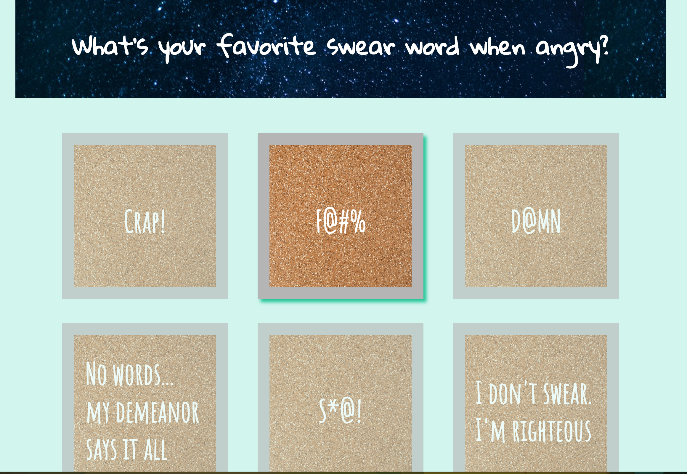

# README.md
Jane Lee

CS 52 Web-Dev with Tim Tregubov

**Buzzfeed Quiz - Lab 2**

## Description

This is a Buzzfeed Quiz made with HTML, CSS, and Javascript with use of Jquery.  It will tell the users *exactly* how extra they are.  

## Notes
### What worked, what didn't

I had a lot of trouble with getting images to resize correctly and it was tricky to get the opaque functionality (where the options that aren't selected fade).  I was able to use javascript to add classes and remove classes in css, and this helped with a lot of hiding and showing elements.  One thing that doesn't work that I would have liked to fix is that when the cursor is hovering above text on the answers (for two of the questions), the hover effect goes away, even though it still clicks and works.  

I think what worked really well was the jquery components in the javascript.  They were very helpful because they had all the abstractions of the functions I needed, like .each(), .addClass(), .removeClass()

## Screencaps

Here is a screen cap of the layout stage.  This is only the top of the page when it is first loaded.

Here is an example of the hover and opaque effect.

## References

http://stackoverflow.com/questions/23661927/keep-button-in-active-state-until-clicked-upon-again

http://stackoverflow.com/questions/8708945/how-to-position-text-over-an-image-in-css

http://stackoverflow.com/questions/5568398/change-the-opacity-of-all-elements-except-the-one-selected
